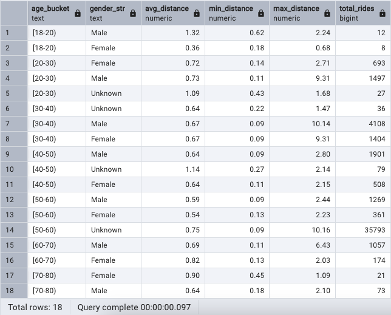
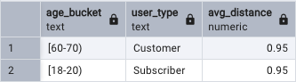

# Exploring 2021 CitiBike Ride Data with SQL

##  Overview
`In this project, I explored 2021 CitiBike ride data and calculated summary statistics in regards to age, gender, and user type (subscriber or non-subscriber). I conducted my analysis by importing the dataset into a local PostgreSQL database and then using SQL to perform aggregrate functions.` </br></br>
`* Note: the dataset only reflects rides in 2021 from specific months (Jan, Feb, March, April) as CitiBike stopped providing data on birth year and gender.`

##  Data
View CitiBike [dataset](https://www.kaggle.com/datasets/vineethakkinapalli/citibike-bike-sharingnewyork-cityjan-to-apr-2021)

#### Columns : 
1. Trip Duration (seconds)
2. Start Time 
3. Stop Time 
4. Start Station Id
5. Start Station Name
6. Start Station Latitude
7. Start Station Longitude
8. End Station Id
9. End Station Name
10. End Station Latitude
11. End Station Longitude
12. Bike Id
13. User Type (Customer, Subscriber)
14. Gender (0 = Unknown, 1 = Male, 2 = Female)
15. Birth Year
<br/>

##  1.0 Import / Preview Data

````sql
-- Create table with schema
CREATE TABLE IF NOT EXISTS rides (
  ride_duration numeric,
  start_time time without time zone,
  stop_time time without time zone,
  start_station_id integer,
  start_station text,
  start_station_latitude numeric,
  start_station_longitude numeric,
  end_station_id integer,
  end_station text,
  end_station_latitude numeric,
  end_station_longitude numeric,
  bike_id integer,
  user_type text,
  birth_year integer,
  gender_num integer
);
````

````sql
-- Import CSVs into DB
COPY rides FROM '/datasets/Jan2021.csv' WITH (FORMAT csv, header);
COPY rides FROM '/datasets/Feb2021.csv' WITH (FORMAT csv, header);
COPY rides FROM '/datasets/Mar2021.csv' WITH (FORMAT csv, header);
COPY rides FROM '/datasets/Apr2021.csv' WITH (FORMAT csv, header);
````

````sql
-- View rides table
SELECT *
FROM rides;
````

<br/>

##  2.0 Create Temporary Table

````sql
-- Create temporary table
DROP TABLE IF EXISTS rides_temp;
CREATE TEMP TABLE rides_temp AS
	SELECT *,
	ABS(birth_year-2021) AS age
FROM rides;
````

````sql
-- Convert ride duration from seconds --> minutes
UPDATE rides_temp
SET ride_duration = (ride_duration / 60);
````
<br/>

##  3.0 Calculate: Ride Duration by Age

````sql
-- Calculate ride duration (avg, min, max) by age
SELECT 
	age, 
	ROUND(AVG(ride_duration),2) AS avg_duration,
	ROUND(MIN(ride_duration),2) AS min_duration,
	ROUND(MAX(ride_duration),2) AS max_duration,
	COUNT(*) AS total_rides
FROM rides_temp
WHERE start_station_id <> end_station_id -- filter out rides that ended at starting station
GROUP BY age
ORDER BY avg_duration DESC;
````
  
<br/>
- 22 year-olds had the highest `avg_duration` per ride: 48 minutes
<br/><br/>

````sql
-- Calculate max ride duration by age
SELECT 
	age, 
	ROUND(MAX(ride_duration),2) AS max_duration,
	COUNT(*) AS total_rides
FROM rides_temp
WHERE start_station_id <> end_station_id
GROUP BY age
ORDER BY max_duration DESC
LIMIT 1;
````

<br/>
- A 51 year-old had the highest `max_duration` per ride: 30,926 minutes
  -  <u>Hypothesis:</u> this rider most likely failed to dock / end their ride properly
  - Such outliers skew values of `avg_duration`
<br/><br/>

##  3.1 Calculate: Median Ride Duration by Age (due to outliers)
````sql
-- Calculate median (less influenced by outliers)
SELECT 
	age, 
	PERCENTILE_CONT(0.5) WITHIN GROUP (ORDER BY ride_duration)::decimal(8,2) AS med_duration,
	ROUND(AVG(ride_duration),2) AS avg_duration,
	ROUND(MIN(ride_duration),2) AS min_duration,
	ROUND(MAX(ride_duration),2) AS max_duration,
	COUNT(*) AS total_rides
FROM rides_temp
WHERE start_station_id <> end_station_id
GROUP BY age
HAVING COUNT(*) >= 10 -- filter out groups < 10 records
ORDER BY med_duration DESC;
````
<br/>
- 48-year olds had the highest `med_duration` per ride: 14.11 minutes
<br/><br/>

##  4.0 Calculate Column: Distance Traveled (using Latitude/Longitude)
````sql
-- Calculate distance traveled using latitude/longitude
ALTER TABLE rides_temp ADD distance_traveled_mi numeric;
UPDATE rides_temp 
SET distance_traveled_mi = 
	SQRT(POW(69.1 * (start_station_latitude::float -  end_station_latitude::float), 2) 
	+ POW(69.1 * (end_station_longitude::float - start_station_longitude::float) 
	* COS(start_station_latitude::float / 57.3), 2));
````
</br>

##  4.1 Calculate: Distance Traveled (by User Type)
````sql
-- Calculate distance traveled by user_type (customer vs. subscriber)
SELECT 
	user_type,
	ROUND(AVG(distance_traveled_mi),2) AS avg_distance,
	ROUND(MIN(distance_traveled_mi),2) AS min_distance,
	ROUND(MAX(distance_traveled_mi),2) AS max_distance,
	COUNT(*) AS total_rides
FROM rides_temp
WHERE start_station_id <> end_station_id
GROUP BY user_type
ORDER BY avg_distance DESC;
````
<br/>
- Non-subscribers (`user_type = 'Customer'`) averaged 0.75 mi/ride 
- Subscribers (`user_type = 'Subscriber'`) averaged 0.66 mi/ride
<br/><br/>

##  4.2 Calculate: Distance Traveled (by Gender)
````sql
-- Create column with string version of gender
ALTER TABLE rides_temp ADD gender_str text;
UPDATE rides_temp	
SET gender_str =
	CASE 
		WHEN gender_num = 1 THEN 'Male'
		WHEN gender_num = 2 THEN 'Female'
		ELSE 'Unknown' 
	END;
````

````sql
-- Calculate distance traveled by gender (male vs. female vs. unknown)
SELECT 
	gender_str,
	ROUND(AVG(distance_traveled_mi),2) AS avg_distance,
	ROUND(MIN(distance_traveled_mi),2) AS min_distance,
	ROUND(MAX(distance_traveled_mi),2) AS max_distance,
	COUNT(*) AS total_rides
FROM rides_temp
WHERE start_station_id <> end_station_id
GROUP BY gender_str
ORDER BY avg_distance DESC;
````
<br/>
- `'Male'` and `Female` riders <u>both</u> averaged 0.67 miles per ride 
- Riders of `'Unknown'` gender averaged 0.75 miles per ride 
<br/><br/>

##  5.0 Create Age Buckets / Bins
````sql
-- Create age buckets for each decade (starting from min age: 18)
ALTER TABLE rides_temp ADD age_bucket text;
UPDATE rides_temp 
SET age_bucket =
	CASE 
		WHEN age >= 10 AND age < 20 THEN'[18-20)'
		WHEN age >= 20 AND age < 30 THEN'[20-30)'
		WHEN age >= 30 AND age < 40 THEN'[30-40)' 
		WHEN age >= 40 AND age < 50 THEN'[40-50)' 
		WHEN age >= 50 AND age < 60 THEN'[50-60)' 
		WHEN age >= 60 AND age < 70 THEN'[60-70)' 
		WHEN age >= 70 AND age < 80 THEN'[70-80)' 
	END;
````
<br/>

##  5.1 Calculate: Distance Traveled (by Age Bucket)
````sql
-- Calculate distance traveled by age_bucket
SELECT 
	age_bucket, 
	ROUND(AVG(distance_traveled_mi),2) AS avg_distance,
	ROUND(MIN(distance_traveled_mi),2) AS min_distance,
	ROUND(MAX(distance_traveled_mi),2) AS max_distance,
	COUNT(*) AS total_rides
FROM rides_temp
WHERE start_station_id <> end_station_id
GROUP BY CUBE(age_bucket)
ORDER BY age_bucket asc;
````
<br/>
- Riders aged `[18,20)` had the highest `avg_distance` traveled per ride: 0.94 miles
- Total `avg_distance` traveled per ride (for ALL age buckets): 0.73 miles
<br/><br/>

##  5.2 Calculate: Distance Traveled (by Age Bucket AND Gender)

````sql
-- Calculate distance traveled by age_bucket AND gender
SELECT 
	age_bucket, 
	gender_str,
	ROUND(AVG(distance_traveled_mi),2) AS avg_distance,
	ROUND(MIN(distance_traveled_mi),2) AS min_distance,
	ROUND(MAX(distance_traveled_mi),2) AS max_distance,
	COUNT(*) AS total_rides
FROM rides_temp
WHERE start_station_id <> end_station_id
GROUP BY age_bucket, gender_str
ORDER BY age_bucket;
````
<br/>
<br/>

````sql
-- Calculate HIGHEST avg_distance traveled by age_bucket AND gender
SELECT 
	age_bucket,
	gender_str,
	ROUND(AVG(distance_traveled_mi),2) AS avg_distance
FROM rides_temp
WHERE start_station_id <> end_station_id
GROUP BY age_bucket, gender_str
ORDER BY avg_distance DESC
LIMIT 1;
````
<br/>
- `Males` aged `[18,20)` had the highest `avg_distance` traveled per ride: 1.32 miles
<br/><br/>

##  5.3 Calculate: Distance Traveled (by Age Bucket AND User Type)
````sql
-- Calculate distance traveled by age_bucket AND user_type
SELECT 
	age_bucket, 
	user_type,
	ROUND(AVG(distance_traveled_mi),2) AS avg_distance,
	ROUND(MIN(distance_traveled_mi),2) AS min_distance,
	ROUND(MAX(distance_traveled_mi),2) AS max_distance,
	COUNT(*) AS total_rides
FROM rides_temp
WHERE start_station_id <> end_station_id
GROUP BY age_bucket, user_type
ORDER BY age_bucket;
````
<br/><br/>

````sql
-- Calculate HIGHEST avg_distance traveled by age_bucket AND user_type
SELECT 
	age_bucket, 
	user_type,
	ROUND(AVG(distance_traveled_mi),2) AS avg_distance
FROM rides_temp
WHERE start_station_id <> end_station_id
GROUP BY age_bucket, user_type
ORDER BY avg_distance DESC
LIMIT 2;
````
<br/>
- `Subscribers` aged `[18,20)` and `Customers` aged `[60,70)` tied for highest `avg_distance` traveled per ride: 0.95 miles
<br/><br/>